  

## 🌠 You found Minky! 🌠

 I’m an aspiring data engineer, currently building strong fundamentals.  
❔ I want to become a engineer who knows when to ask why.  
🌌 My code runs on matcha latte, my off-days run on flute, and my best ideas often arrive post-workout.
  
---

## 🛠 Tech Stack & Tools I'm Learning

---

## GitHub Readme Stats

  
  

---

## 🔭 Currently Working On

### LOSTORY
 [LOSTORY](https://github.com/26-summer-aisw-project)
 Safe lost-and-found matching and management service  
- Planning MVP scope and service flow
- Designing QR-based intake for found and lost item reports
- Learning backend structure with Spring Boot
- Exploring how AI/Vision API can support safe item matching

### MULGIL
[MULGIL](https://github.com/Mulgil)
AI-based learning assistant app that helps students organize lecture materials, review key concepts, and build consistent study habits.
- Lecture material and note summarization
- Quiz-based concept checking
- Personalized review reminders

---

## 📌 Previous Projects

### DARWIN-RAG
[DARWIN-RAG](https://github.com/SoftwareProject26S1)
Research project on improving RAG answer reliability through dynamic routing  
- Studied how question categories can affect document retrieval quality
- Explored dynamic routing and adaptive weighting in RAG
- Organized research direction, experiment ideas, and presentation materials

---

## 🌱 Studying Now

- Programming fundamentals
- Backend development
- Data Lakehouse architecture and data engineering workflows
  
---

## ✨ YOU CAN ALWAYS
reach out to me if you’d like to connect, collaborate, discuss backend development, share ideas about service planning, or even workouts and musical instruments.

